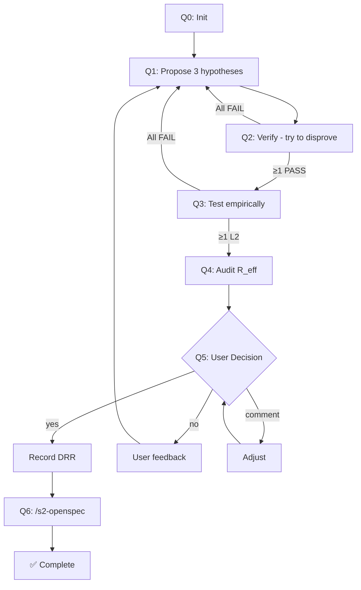

# S1-Quint: FPF Reasoning Cycle

> **Prerequisite:** Load `shared-core.md` for term definitions ($STDS, $BASE, Surgical_Scope, AntiRot).

**Problem:** $ARGUMENTS

**System:** Windows + PowerShell (`pwsh`) for all Bash commands.

---

## CRITICAL: MCP Tools vs Skills

| Type | Invocation | Example |
|------|------------|---------|
| **MCP Tools** | Call directly | `quint_status`, `quint_propose` |
| **Skills** | `/skill-name` or auto-loaded | `/s2-openspec` |

> ❌ **WRONG:** `Skill(quint_status)` — will fail
> ✅ **CORRECT:** Call `quint_status` as MCP tool

---

## MCP Tools (quint-code)

| Tool                   | Purpose                           |
| ---------------------- | --------------------------------- |
| `quint_init`           | Initialize FPF structure          |
| `quint_record_context` | Record bounded context            |
| `quint_status`         | Get current phase                 |
| `quint_propose`        | Register L0 hypothesis            |
| `quint_verify`         | Logic verification (L0→L1)        |
| `quint_test`           | Empirical validation (L1→L2)      |
| `quint_audit`          | Risk analysis                     |
| `quint_calculate_r`    | Compute R_eff                     |
| `quint_audit_tree`     | Visualize assurance tree          |
| `quint_check_decay`    | Check evidence freshness          |
| `quint_actualize`      | Sync FPF state with repo changes  |
| `quint_decide`         | Record DRR (Q5 only)              |

---

## Phase 0: Initialize & Research (Q0)

1. `quint_status` — check if FPF initialized
2. `quint_init` — if not, set up `.quint/`
3. `quint_record_context` — capture vocabulary and invariants
4. Research: `es_search_files`, `grepai_search`, `serena_find_symbol`
5. Online verification (MANDATORY): `web-search-prime` / `zread`

---

## Phase 1: Abduction (Q1)

Generate 3 hypotheses:
1. **[Naive]**: Simplest solution
2. **[Standard]**: Best practice
3. **[Lateral]**: Out-of-box

Register with `quint_propose`.

---

## Phase 2: Deduction (Q2)

- Try to disprove each hypothesis
- Check SOLID/DRY violations
- `quint_verify` — mark PASS/FAIL

If ALL fail → return to Phase 1.

---

## Phase 3: Induction (Q3)

- Deep read implementation files
- Propose test strategies
- `quint_test` — promote valid to L2

If none at L2 → return to Phase 1.

---

## Phase 4: Audit (Q4)

- Calculate R_eff, Effort, ROI for each
- Identify Weakest Link
- `quint_audit` + `quint_calculate_r`

---

## Phase 5: Decision (Q5) — MANDATORY USER GATE

> ⛔ **CRITICAL:** This phase REQUIRES explicit user approval. DO NOT auto-proceed.

### 5.1 Present Recommendation

| Hypothesis | R_eff | Effort | ROI | Recommendation |
|------------|-------|--------|-----|----------------|
| ...        | ...   | ...    | ... | ...            |

### 5.2 Ask for Confirmation

```
🔒 DECISION REQUIRED

Recommendation: [hypothesis-name]
Rationale: [brief why]

Options:
  yes     → Record DRR, proceed to implementation
  no      → Provide feedback, return to relevant phase
  comment → Adjust recommendation based on your input

Your decision: ___
```

### 5.3 STOP — Wait for User Response

> ⛔ **MANDATORY STOP**
> 
> DO NOT proceed until user explicitly responds.
> DO NOT assume "yes" if no response.
> DO NOT auto-continue after presenting options.

**Flow:**
- User says **"yes"** → Proceed to 5.4
- User says **"no"** → Ask what to change, return to Phase 1-4
- User says **"comment: [text]"** → Adjust, re-present 5.2

### 5.4 Record Decision (ONLY after explicit "yes")

```
PRECONDITION: User has explicitly said "yes" or equivalent approval.
```

Call `quint_decide` with:
- `winner_id`: approved hypothesis
- `rationale`: why chosen
- `consequences`: expected impact

## Phase 6: Handoff to S2

> ⛔ **CRITICAL: DO NOT SKIP THIS PHASE**
> 
> You MUST invoke s2-openspec. DO NOT go directly to code editing.
> Using `serena_*`, `Edit`, or `Write` tools is FORBIDDEN until s2-openspec completes.

### 6.1 Verify DRR Exists (MUST DO)

Check for DRR file in `.quint/decisions/`:
- If exists → Proceed to 6.2
- If not → ERROR. Return to Phase 5.

### 6.2 Invoke S2-OpenSpec (MUST DO)

**Invoke skill with DRR ID:**
```
/s2-openspec <drr-id>
```

S2 handles all implementation details. Wait for completion.

### 6.3 Confirm Completion

When s2-openspec returns success → Q6 complete.

---

## Anti-Bypass Rules

| Violation | Consequence |
|-----------|-------------|
| Using `serena_*`/`Edit`/`Write` before s2 | ⛔ INVALID — revert changes |
| Skipping `/s2-openspec` | ⛔ INVALID — no spec-driven impl |
| Not waiting for s2 completion | ⛔ INVALID — unverified changes |

## Flow Coverage (All Paths)



---

## Failure Rules

| Condition | Action |
|-----------|--------|
| `quint_verify` fails ALL | Return to Q1 (generate different hypotheses) |
| `quint_test` fails ALL | Return to Q1 |
| 3 consecutive Q1 failures | STOP, ask user for guidance |
| User says "no" at Q5 | Ask for feedback, return to Q1-Q4 |
| User says "comment" at Q5 | Adjust recommendation, re-present Q5 |
| No response at Q5 | WAIT (do not assume yes) |
| DRR not found at Q6 | ERROR, return to Q5 |
| `/s2-openspec` fails | STOP, FIX, RETRY (do not proceed) |

---

## Output

Complete FPF cycle. Implementation via `/s2-openspec` after **explicit** user Q5 approval.

