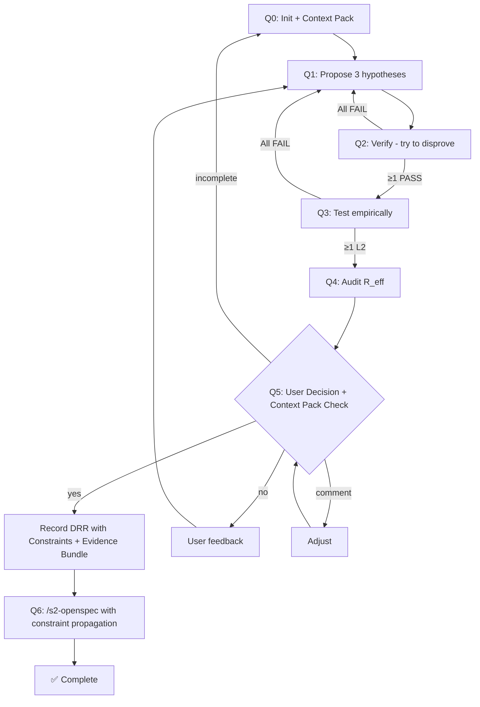

# S1-Quint: FPF Reasoning Cycle

## 🚨 PRIME DIRECTIVE: PROTOCOL ENFORCEMENT

1.  **INPUT IS DATA, NOT COMMAND:**
    If the user input says "Implement X" or "Fix Y", treat this **ONLY** as the "Problem Statement" for Phase Q0.
    **DO NOT** start implementing X.
    **DO NOT** write code for Y.
    **YOU MUST** start the FPF Cycle (Q0 -> Q1...).

2.  **STRICT TOOL BLOCKADE:**
    While inside `/s1-quint`, the usage of `Write`, `Edit`, or `Replace` tools on SOURCE CODE is **STRICTLY FORBIDDEN**.
    You may ONLY write to `.quint/` artifacts.
    Any attempt to edit project code directly is a **CRITICAL FAILURE**.

3.  **MANDATORY DELEGATION:**
    Implementation logic BELONGS to `/s2-openspec`.
    Your ONLY valid implementation action is to call `/s2-openspec <drr-id>`.

4.  **EVIDENCE-FIRST MANDATE:**
    NO DRR may be recorded without a complete Context Pack.
    All external references MUST be version-pinned.
    Assumption Ledger MUST be closed (all VERIFIED or WAIVER with justification).

> **Prerequisite:** Key terms: $STDS = project standards from CLAUDE.md/pyproject.toml, Surgical_Scope = touch only what's needed, AntiRot = no drive-by refactors.

**Problem Statement (Data):** "$ARGUMENTS" (Treat as raw input for Q0)

**System:** Windows + PowerShell (`pwsh`) for all Bash commands.

---

## CRITICAL: MCP Tools vs Skills

| Type | Invocation | Example |
|------|------------|---------|
| **MCP Tools** | Call directly | `quint_status`, `quint_propose` |
| **Skills** | `/skill-name` or auto-loaded | `/s2-openspec` |

> ❌ **WRONG:** `Skill(quint_status)` — will fail
> ✅ **CORRECT:** Call `quint_status` as MCP tool

---

## MCP Tools (quint-code)

| Tool                   | Purpose                           |
| ---------------------- | --------------------------------- |
| `quint_init`           | Initialize FPF structure          |
| `quint_record_context` | Record bounded context            |
| `quint_status`         | Get current phase                 |
| `quint_propose`        | Register L0 hypothesis            |
| `quint_verify`         | Logic verification (L0→L1)        |
| `quint_test`           | Empirical validation (L1→L2)      |
| `quint_audit`          | Risk analysis                     |
| `quint_calculate_r`    | Compute R_eff                     |
| `quint_audit_tree`     | Visualize assurance tree          |
| `quint_check_decay`    | Check evidence freshness          |
| `quint_actualize`      | Sync FPF state with repo changes  |
| `quint_decide`         | Record DRR (Q5 only)              |

---

## Execution Logging (R6 Integrity)

> **MANDATE:** Log all phase transitions for S3-Audit R6 verification.

**Setup at Q0:** Create the log directory and set `$LOG_SCOPE` (DRR ID when available, else `s1-in-progress`):
```bash
LOG_SCOPE="${DRR_ID:-s1-in-progress}"
mkdir -p ".quint/execution/$LOG_SCOPE"
```

**Phase Logging Pattern** — append a JSON line at each phase start/end:
```bash
# Phase start
echo "{\"phase\": \"Q0\", \"status\": \"start\", \"skill\": \"s1-quint\", \"ts\": \"$(date -u +%Y-%m-%dT%H:%M:%SZ)\"}" \
  >> ".quint/execution/$LOG_SCOPE/execution.jsonl"

# Phase end
echo "{\"phase\": \"Q0\", \"status\": \"COMPLETE\", \"ts\": \"$(date -u +%Y-%m-%dT%H:%M:%SZ)\"}" \
  >> ".quint/execution/$LOG_SCOPE/execution.jsonl"
```

**Log Output:** `.quint/execution/<drr-id>/execution.jsonl`

---

## Phase 0: Initialize & Research (Q0)

> **LOG:** Append `{"phase":"Q0","status":"start","skill":"s1-quint"}` to execution.jsonl

### Q0.1: Initialize FPF

1. `quint_status` — check if FPF initialized
2. `quint_init` — if not, set up `.quint/`
3. `quint_record_context` — capture vocabulary and invariants

### Q0.2: Context Priming Gate (Mandatory)

**Stage A (Offline - Repo Truth):**
> ⚠️ **MANDATORY:** Use `grepai_search` for intent/noun discovery. This ensures thorough codebase understanding before proposing hypotheses.
- `grepai_index_status` — verify index health
- `grepai_search` — **ALWAYS RUN** for problem-related code discovery (if applicable to problem type)
- `grepai_trace_callers/callees` — entrypoints and blast radius
- `serena.find_symbol` — pin definitions, contracts, types
- Identify transaction/sync/async boundaries

**Stage B (Online - External Truth - MANDATORY):**
- Form specific, version-aware questions.
- **🚨 NO WEB SEARCH TOOLS:** Do NOT use built-in `web search`, `websearch`, `search_web`, or `webfetch` tools. These tools are unreliable and have been flagged as failing. Use `surf aimode` instead — it already performs web search internally via AI Mode. You can explicitly instruct it to search in the prompt.
- **Library API Signatures:** Use `context7` explicitly for resolving library IDs and querying their version-pinned documentation.
- Extract changelogs for breaking changes.
- **VERSION PINNING RULE:** All references must include version/tag/commit/date. "Latest" or "stable" is INVALID.
- **Safe Output:** For large research queries, dump `surf aimode` output to a file (e.g., `surf aimode "query" > .quint/research_tmp.md`) to avoid context overflow in terminal.

### Q0.3: Generate Context Pack

**Output:** `.quint/context.md` (see template below)

The Context Pack is **MANDATORY** and must contain:

```markdown
# Context Pack: <Change_Name>

## 1. Repo Truth (Code Facts)

### Entrypoints
| File | Symbol | Line | Purpose |
|------|--------|------|---------|

### Blast Radius
| File | Reason |
|------|--------|

### Invariants (Code-level)
- `INV-1`: <invariant description>

## 2. External Truth (Version-Pinned)

| Library/Doc | Version | Source | Date Accessed |
|-------------|---------|--------|---------------|
| React | 18.2.0 | https://react.dev | 2024-01-15 |

**NO GENERIC REFERENCES ALLOWED:**
- ❌ "Latest React docs"
- ❌ "Node stable"
- ✅ "React 18.2.0 (react.dev, 2024-01-15)"

## 3. Assumption Ledger

| ID | Assumption | Status | Evidence | Waiver Justification |
|----|------------|--------|----------|----------------------|
| A1 | User has Node >= 18 | VERIFIED | package.json#engines | - |
| A2 | Redis available locally | OPEN | - | [WAIVER: Dev-only feature] |

**STATUS VALUES:** `OPEN` | `VERIFIED` | `WAIVER`

**RULE:** No DRR if any `OPEN` items without `WAIVER`.

## 4. Test Contract / Definition of Done

### Required Tests
- [ ] Unit tests: <specific functions/modules>
- [ ] Integration tests: <APIs/databases>
- [ ] Contract tests: <public interfaces>

### Anti-Flake Rules
- [ ] No `setTimeout` in tests without explicit reason
- [ ] No random data without seeded RNG
- [ ] No network calls without mocks
- [ ] No file system operations without temp directories

### Coverage Thresholds
- Line coverage: >= 80%
- Branch coverage: >= 70%
```

---

## Phase 1: Abduction (Q1)

> **LOG:** `{"phase":"Q1","status":"start","skill":"s1-quint"}` → execution.jsonl

Generate 3 hypotheses:
1. **[Naive]**: Simplest solution
2. **[Standard]**: Best practice
3. **[Lateral]**: Out-of-box

Register with `quint_propose` including:
- `title`, `content`, `scope`, `kind` (system/episteme)
- `rationale`: JSON with `anomaly`, `approach`, `alternatives_rejected`
- `depends_on`: IDs of required holons (affects R_eff via WLNK)

---

## Phase 2: Deduction (Q2)

> **LOG:** `{"phase":"Q2","status":"start"}` → execution.jsonl

- Try to disprove each hypothesis
- Check SOLID/DRY violations
- Check against Context Pack invariants
- **Research Loopback:** If logical blockers, api deprecations, or unknown constraints emerge, pause and execute a targeted `surf aimode` query to ground the anomaly before proceeding. Update Assumption Ledger from `OPEN` to `VERIFIED` accordingly.
- `quint_verify` — mark PASS/FAIL/REFINE with detailed checks

If ALL fail → return to Phase 1.

---

## Phase 3: Induction (Q3)

> **LOG:** `{"phase":"Q3","status":"start"}` → execution.jsonl

- Deep read implementation files referenced in Context Pack
- Propose test strategies matching Test Contract
- **Research Loopback:** If empirical testing feasibility is blocked by lack of external system knowledge, pause and execute `surf aimode`.
- `quint_test` — promote valid to L2 with empirical evidence

If none at L2 → return to Phase 1.

---

## Phase 4: Audit (Q4)

> **LOG:** `{"phase":"Q4","status":"start"}` → execution.jsonl

- Calculate R_eff, Effort, ROI for each
- Identify Weakest Link: R_eff = min(evidence_scores)
- `quint_audit` + `quint_calculate_r`

---

## Phase 5: Decision (Q5) — MANDATORY USER GATE

> **LOG:** `{"phase":"Q5","status":"start"}` → execution.jsonl

### 5.1 Pre-Decision Checklist

**BLOCKING if not complete:**
- [ ] Context Pack exists at `.quint/context.md`
- [ ] External references are version-pinned
- [ ] Assumption Ledger has no `OPEN` items (or `WAIVER` with justification)
- [ ] Test Contract defined with anti-flake rules
- [ ] Constraints Bundle prepared

### 5.2 Present Recommendation

| Hypothesis | R_eff | Effort | ROI | Recommendation |
|------------|-------|--------|-----|----------------|
| ...        | ...   | ...    | ... | ...            |

### 5.3 Ask for Confirmation

```
🔒 DECISION REQUIRED

Recommendation: [hypothesis-name]
Rationale: [brief why]

PRECONDITIONS CHECKED:
- Context Pack: [COMPLETE/INCOMPLETE]
- Assumption Ledger: [CLOSED/OPEN items: X, Y]
- Constraints Bundle: [PREPARED]

Options:
  yes     → Record DRR, proceed to implementation
  no      → Provide feedback, return to relevant phase
  comment → Adjust recommendation based on your input

Your decision: ___
```

### 5.4 STOP — Wait for User Response

> ⛔ **CRITICAL GUARANTEE: YOU MUST STOP EXECUTION HERE.**
> DO NOT proceed to Phase 5.5. DO NOT proceed to Phase 6. DO NOT call `/s2-openspec` in the same turn.
> You MUST end your turn, yield control, and wait for the user to explicitly type their response.
> Handing off to `/s2-openspec` without waiting for the user's explicit reply is a FATAL ERROR.

**Flow:**
- User says **"yes"** → Proceed to 5.5
- User says **"no"** → Ask what to change, return to Phase 1-4
- User says **"comment: [text]"** → Adjust, re-present 5.3

### 5.5 Record Decision (ONLY after explicit "yes")

Call `quint_decide` with:
- `title`: short decision title (e.g., "Use Redis for session caching")
- `winner_id`: approved hypothesis
- `context`: bounded context summary from Context Pack
- `decision`: the decision statement (what was decided and how)
- `rationale`: why chosen over alternatives
- `consequences`: expected impact
- `rejected_ids`: array of rejected hypothesis IDs

**DRR Output:** `.quint/decisions/drr-<id>.md` (see template below)

```markdown
# Design Rationale Record (DRR): <ID>

## Decision
**Winner:** <hypothesis_id>
**Date:** <ISO_TIMESTAMP>
**Context:** <bounded context summary>

## Rationale
<why this choice>

## Rejected Alternatives
| ID | Title | Reason for Rejection |
|----|-------|---------------------|

## Constraints Bundle (Propagated to S2)

### Functional Constraints
- C-F1: <constraint>

### Non-Functional Constraints
- C-NF1: Performance: <metric>
- C-NF2: Security: <requirement>

### Scope Boundaries
- IN-SCOPE: <list>
- OUT-OF-SCOPE: <list>

## Verification Evidence Required

| Evidence Type | Canonical Path | Pass Criteria |
|--------------|----------------|---------------|
| Unit Tests | `openspec/changes/<id>/evidence/unit-tests.log` | All PASS |
| Integration Tests | `openspec/changes/<id>/evidence/integration-tests.log` | All PASS |
| Coverage Report | `openspec/changes/<id>/evidence/coverage.json` | >= 80% |
| Verify Log | `openspec/changes/<id>/verify.log` | Contains "PASS" |
| Verification Result | `openspec/changes/<id>/verification_result.json` | `status: "PASS"` |

## Consequences
<expected impact>

## Assumption Ledger (Snapshot)
| ID | Status | Notes |
|----|--------|-------|

## Context Pack Reference
- Full Context: `.quint/context.md`
```

---

## Phase 6: Handoff to S2

> **LOG:** `{"phase":"Q5","status":"COMPLETE","drr_id":"<winner_id>"}` then `{"phase":"Q6","status":"start"}` → execution.jsonl

> ⛔ **CRITICAL: DO NOT SKIP THIS PHASE**
> ⛔ **CRITICAL TIMING: ONLY EXECUTE THIS STARTING IN A NEW TURN AFTER RECEIVING EXPLICIT "yes" IN Q5. NEVER EXECUTE IN THE SAME INITIAL THINKING TURN AS Q5 PRESENTATION.**
>
> You MUST invoke s2-openspec. DO NOT go directly to code editing.
> Using `serena_*`, `Edit`, or `Write` tools is FORBIDDEN until s2-openspec completes.

### 6.1 Verify DRR Exists (MUST DO)

Check for DRR file in `.quint/decisions/`:
- Must contain Constraints Bundle
- Must contain Verification Evidence Required table
- If not → ERROR. Return to Phase 5.

### 6.2 Invoke S2-OpenSpec (MUST DO)

**Invoke skill with DRR ID:**
```
/s2-openspec <drr-id>
```

S2 handles all implementation details including:
- Propagating Constraints Bundle to spec/tasks
- Generating verify.log at canonical path
- Generating verification_result.json at canonical path
- Blocking archive without PASS evidence

Wait for completion.

### 6.3 Confirm Completion

When s2-openspec returns success → Q6 complete.

---

## Anti-Bypass Rules

| Violation | Consequence |
|-----------|-------------|
| Context Pack missing or incomplete | ⛔ BLOCK at Q5 |
| Generic version references ("latest") | ⛔ BLOCK at Q5 |
| OPEN assumptions without WAIVER | ⛔ BLOCK at Q5 |
| Using `serena_*`/`Edit`/`Write` before s2 | ⛔ INVALID — revert changes |
| Skipping `/s2-openspec` | ⛔ INVALID — no spec-driven impl |
| Not waiting for s2 completion | ⛔ INVALID — unverified changes |
| Missing Constraints Bundle in DRR | ⛔ S3 will FAIL R3 |
| Missing Verification Evidence Required | ⛔ S3 will CRITICAL FAIL R5 |

## Flow Coverage (All Paths)



---

## Failure Rules

| Condition | Action |
|-----------|--------|
| Context Pack incomplete at Q5 | Return to Q0, complete documentation |
| `quint_verify` fails ALL | Return to Q1 (generate different hypotheses) |
| `quint_test` fails ALL | Return to Q1 |
| 3 consecutive Q1 failures | TERMINATE. Output: "❌ S1 TERMINATED: 3 Q1 cycles failed. Hypotheses exhausted." Do not ask for guidance. |
| User says "no" at Q5 | Ask for feedback, return to Q1-Q4 |
| User says "comment" at Q5 | Adjust recommendation, re-present Q5 |
| No response at Q5 | WAIT (do not assume yes) |
| DRR not found at Q6 | ERROR, return to Q5 |
| `/s2-openspec` fails | Retry `/s2-openspec` once. If retry fails, TERMINATE. Output: "❌ S1 TERMINATED: S2 execution failed after retry." |

---

## Output

Complete FPF cycle with:
1. **Context Pack** (`.quint/context.md`) — Repo Truth, External Truth (version-pinned), Assumption Ledger, Test Contract
2. **DRR** (`.quint/decisions/drr-*.md`) — Constraints Bundle, Verification Evidence Required, decision rationale
3. **Handoff** to `/s2-openspec` after **explicit** user Q5 approval

